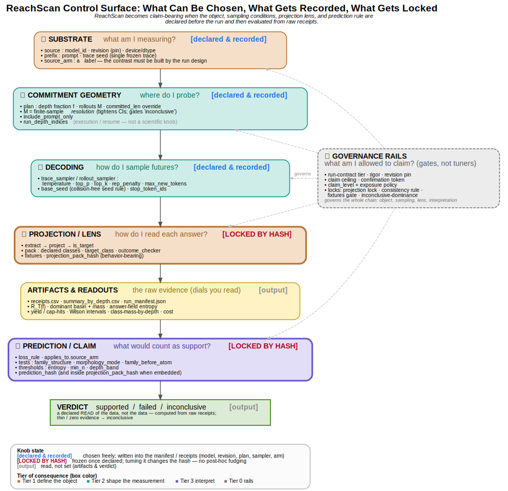

# reachscan

**Measure the future field of a committed reasoning prefix.**


[](LICENSE)
[](https://doi.org/10.5281/zenodo.20808922)

Endpoint accuracy collapses a model's behavior into one label. `reachscan` measures
something richer: given a *committed* reasoning prefix, what is the distribution of
answer-futures the model can still reach — and how does target reachability change
as commitment deepens? It is a small, reusable instrument for studying *reasoning
failure as a loss of reachable future under commitment.*

This is the language-model sibling of the oracle-backed random 3-SAT
[constructive-accessibility instrument](https://doi.org/10.5281/zenodo.19225548).
The two share a measurement grammar (committed state → reachable future); the
substrates and guarantees differ.

> Status: v0.3.2. The engine and reference components are tested. The worked example
> reproduces the *shape* of the flagship result on a mock or a small live model; it
> is not a release of production data.

## Install

```bash
pip install -e .            # core, zero heavy dependencies (mock path)
pip install -e ".[hf]"      # add a real HuggingFace model source
pip install -e ".[projection]"  # add projection-pack support (PyYAML)
pip install -e ".[test]"    # run the tests
```

## Quick start (no GPU, mock source)

```bash
reachscan-demo --out demo_run
```

This runs a reach-scan with a **mock** source. It proves the pipeline end to end
and shows the readout format, but the mock is a deterministic fixture, **not a
real model** — the numbers are illustrative, not a result. For a real measurement,
point it at a model:

```bash
reachscan-demo --hf Qwen/Qwen2.5-Math-7B-Instruct --out qwen_run   # needs [hf] extra + GPU
```

For longer Colab/GPU runs, use
[`notebooks/reachscan_quickstart.ipynb`](notebooks/reachscan_quickstart.ipynb).
The notebook starts with an explicit run contract: no model is selected by
default, and the run cannot proceed until a tier, revision policy, claim ceiling,
and model-specific confirmation token agree. See
[`docs/CHOOSE_YOUR_RUN.md`](docs/CHOOSE_YOUR_RUN.md) before spending GPU time.
The notebook prints resource diagnostics, caches the generated reference trace,
and checkpoints each completed depth so a disconnected runtime can skip finished
depths on rerun while preserving the original depth indices and seed rule.

## What it measures

At the prompt-only state and at a series of committed-prefix depths, `reachscan`
samples futures, classifies each extracted answer through a **projection**, and
reports, per depth:

- **target reachability** `R_T(f)` — mass on the task's target set
- **dominant basin** and its mass — where the field concentrates
- **answer-field entropy** — a target-*neutral* dispersion statistic (distinct from
  target reachability, which is target-*relative*)
- **answer yield / truncation / cap-hits** — the denominator audit (`hit_token_cap` flags every generation that filled `max_new_tokens`). Reported as `ok_answers`; the legacy `numeric` column is kept as an alias in v0.2.x and means `status == "ok"` extracted answers, not necessarily numeric values.
- **Wilson intervals** on the rates

### Formal object

Let `s_f` be the prompt followed by the committed prefix at depth fraction `f`,
and let `T` be the task's target set (the correct answer, or its residue class).
The **future field** is the distribution of *successfully extracted* answers under
the declared sampler, conditioned on `s_f`. **Target reachability** is its mass on
the target, conditioned on a valid extraction:

```
R_T(f) = P( extract(Y) ∈ T | extract(Y) defined, committed prefix s_f, declared sampler )
```

The denominator is the **answer yield** — rollouts whose completion produced a
parseable answer (`status == "ok"`); rollouts with no extractable answer are
excluded from the denominator. Cap-hits (generations that filled
`max_new_tokens`) are flagged *independently* — a capped generation that still
produced a parseable answer is counted. When the yield is zero, `R_T` is
**undefined** (reported as `NaN`, with `rate_defined=False`), never zero.
Estimated by `M` independent rollouts per depth and reported with a Wilson
interval. `reachscan` estimates this conditional object — it is not a statement
about the model's internals.

## Scope

This repository is the public **reach-scan core**: the source interfaces, prefix
slicing, projection/target handling, future-field summaries, a mock fixture, a minimal
HuggingFace adapter, a custom-projection example, and a quickstart notebook — enough to
understand the method and run a basic scan on your own model and task.

This is the measurement **core**, not the paper's full reproduction workflow. It does
**not** include candidate mining, exposure auditing, grouped correct/wrong-source
scans, per-trace bootstrap, foreclosure localization, or intervention. The
current-paper evidence and constructors are released through the Evidence and
Reproducibility Archive; additional research tooling is outside this software
release.

## How it works: three contracts + an engine

The engine knows nothing about any specific model or task. It depends on three
small contracts; everything specific lives in implementations of them:

| Contract | Promise | Ships with |
|---|---|---|
| `TokenContinuationSource` | "given a committed prefix, yield sampled futures" | `MockSource`, `HuggingFaceSource` |
| `PrefixSource` | "yield a committed reference trace to slice by fraction" | `GeneratedPrefixSource`, `UserPrefixSource` |
| `Projection` | "classify an extracted answer into a task bucket" | `ExactMatch`, `ModuloProjection`, `TargetFiber` |

To measure **your** model on **your** task, you implement a source and/or a
projection. You never touch the engine.

`TokenContinuationSource` is the first implementation of an abstract
"committed prefix → sampled futures" shape. The engine depends on that shape, not
on tokens as such; other substrates could be measured by implementing the same
shape. None is provided or claimed here.

The shipped real-model source measures an **autoregressive, token-emitting model
you have token-level access to** — a local open-weights model (the typical
HuggingFace path), your own model, or a frontier model *if you hold its weights*.
The line is **token-level access, not public-vs-closed**: it needs to freeze a
committed prefix on token IDs and sample fresh continuations under a declared
sampler, which a hosted chat **API** (Claude/GPT endpoints) does not expose — so
the shipped tool can't run on an API model out of the box. The abstract contract
is substrate-general — other substrates (non-autoregressive / diffusion, agents)
could implement the same "committed state → reachable futures" shape — but those
are **research extensions, not provided or claimed here**; a closed-API adapter
would likewise be possible, with weaker reproducibility guarantees.

> **Using an AI coding agent on this repo?** See [`AGENTS.md`](AGENTS.md) and
> [`docs/agents/`](docs/agents/) for an operator guide that keeps measurements
> honest (no overclaiming, provenance preserved).

## The flagship example

The floor-sum case (correct answer 532; `532 % 8 == 4`) is simply:

```python
projection = ModuloProjection(8, target_residue=4)
```

The flagship is a *configuration* of the general instrument, not a special path.

## Projection packs (v0.3.0)

A **projection pack** makes a task lens executable and auditable: a directory that
declares the parser, the outcome check, the projection classes, and labeled
fixtures, fingerprinted by a **behavior-bearing** hash over its
`projection.yaml` + `adapter.py` + `fixtures.jsonl` (so a parser edit cannot keep
the same identity). The flagship as a pack lives in
[`examples/projections/floor_sum_mod8/`](examples/projections/floor_sum_mod8/).

```bash
pip install -e ".[projection]"
reachscan projection validate examples/projections/floor_sum_mod8
```

A loaded pack also satisfies the `Projection` protocol, so `reach_scan` runs it
directly; a pack-driven run binds the `projection_pack` block (id, version, hash,
declared classes, claim level, fixture-validation result) into `run_manifest.json`
and records `projection_class` + projection identity on every receipt. The engine
stays generic — a plain projection produces no pack block, and `engine_schema`
moved `0.2.8 → 0.3.0` only because receipts and the manifest grew.

To build a lens for **your own** task, copy
[`examples/projections/_template/`](examples/projections/_template/) and follow
[`docs/BUILD_A_PROJECTION_PACK.md`](docs/BUILD_A_PROJECTION_PACK.md).

The pack's predeclared `prediction` block is evaluated from raw receipts into a
`supported / failed / inconclusive` verdict:

```bash
reachscan prediction evaluate <run_dir> --projection examples/projections/floor_sum_mod8
```

The three tests read **wrong-answer morphology** (family structure, capture vs
shatter, family-before-atom); thin/zero evidence is `inconclusive`, never a false
support; and the evaluator refuses a run that used a different pack (it checks the
`projection_pack_hash`). See [`docs/PREDICTION_CONTRACT.md`](docs/PREDICTION_CONTRACT.md).

## Control surface

ReachScan is not one metric — it is an instrument with object-defining knobs,
measurement knobs, a reading lens, and claim gates. The figure below is the whole
control surface as a signal chain (substrate → probe → sample → read → judge):
what can be **chosen**, what gets **recorded**, and what gets **locked**.



> ReachScan becomes claim-bearing when the object, sampling conditions, projection
> lens, and prediction rule are declared before the run and then evaluated from raw
> receipts.

**Operating the instrument:** [`docs/RUN_PATH.md`](docs/RUN_PATH.md) is the
step-by-step procedure (research question → valid run → defensible claim), and
[`docs/CLAIM_LADDER.md`](docs/CLAIM_LADDER.md) is what each run is allowed to
support. The figure names the dials; those two turn it into a workflow.

Source: [`docs/instrument_control_surface.dot`](docs/instrument_control_surface.dot)
(regenerate with `dot -Tsvg docs/instrument_control_surface.dot -o docs/instrument_control_surface.svg`).

## Repo layout

```text
src/reachscan/
  contracts.py        # the three protocols + ExtractedAnswer (the frozen interfaces)
  engine.py           # the reach-scan engine (knows only the contracts)
  projections.py      # ExactMatch, ModuloProjection, TargetFiber
  prefix_sources.py   # GeneratedPrefixSource, UserPrefixSource
  mock_source.py      # zero-dependency test fixture (NOT a real model)
  hf_source.py        # HuggingFaceSource — the live path (optional [hf] extra)
  metadata.py         # provenance stamping + receipts/summary writers
  contrast.py         # source-conditioned separation (the diagnostic kernel)
  projection_pack.py  # v0.3.0 projection packs: load, behavior-bearing hash, fixtures
  prediction.py       # v0.3.1 prediction evaluator: morphology verdict from receipts
  tools/run_demo.py   # the reachscan-demo CLI
  tools/cli.py        # `reachscan projection validate|inspect` + `prediction evaluate`
examples/projections/floor_sum_mod8/   # the flagship as a formal projection pack
tests/
  test_engine.py      # engine correctness + seed/plan guards
  test_projection_pack.py  # pack load/hash/fixtures + receipt/manifest binding
  test_prediction.py       # prediction evaluator: fixtures + verification checks
  test_run_contract.py     # the notebook run-contract gate
```

## Use it on your own task

To measure a task that isn't floor-sum, implement a `Projection` — three methods:
`extract` (pull the answer from completion text), `project` (assign a bucket), and
`is_target` (does it hit the target set?). `examples/custom_projection.py` is a
complete, **non-arithmetic** one (multiple-choice A/B/C/D); run it with no GPU:

```bash
python examples/custom_projection.py
```

Swap your projection in and you are measuring reach-to-target on your task — you
never touch the engine.

## Diagnostic use: source-conditioned contrast

A single reach-scan measures one prefix. The diagnostic question is comparative:
do correct-source and wrong-source committed prefixes reach the target differently,
*before* the answer is exposed? Run a scan on each and contrast them:

```python
from reachscan import source_separation
sep = source_separation(correct_result, wrong_result)   # same depth plan on both
for row in sep:
    print(row.fraction, row.separation, (row.sep_low, row.sep_high))
```

`source_separation` returns the per-depth reachability separation with a Newcombe
confidence interval on the difference. See `examples/source_contrast.py`.

This is the diagnostic *primitive*. Getting labeled correct/wrong source traces, and
finding candidates where the separation is large, is the research: you supply your
own sources, and that apparatus is not included here.

## What reachscan is not

- It is **not** a probe of model internals. The field is a black-box behavioral
  distribution over outputs; it makes no claim about activations or hidden state.
- A **zero count is a finite-budget observation**, not a proof of zero
  probability. Every count is conditional on the declared sampler and on `M`.
- Two tasks in one model is **not** generality. Cross-model and cross-task
  portability are separate claims, earned by replication, not asserted here.

## Limitations

- **Reference extractor.** The shipped `extract` prefers the last `\boxed{...}`,
  strips thousands-commas, and otherwise looks for an explicit answer cue. It does
  not parse scientific notation, units, or symbolic answers, and the no-box
  fallback (last number) is unreliable. Watch the answer-yield column (`ok_answers`), and for
  other answer formats supply your own `extract`. This is a reference component,
  not a production extractor.
- **Cost.** Rollouts are generated one at a time for per-seed reproducibility, so
  large `M` on a real model is slow; batched generation is a future optimization.
- **Reproducibility.** Seeds reproduce the sampling decisions given identical
  logits; bitwise reproduction across different hardware or kernels is not
  guaranteed. Seeds are integers in `[0, 2**64)`; custom sources must accept the
  full range (do not feed them to 32-bit-only seeders).
- **HuggingFaceSource is a reference adapter, not a paper-grade backend.** It pins
  models via the optional `revision` argument, and it builds its decode policy as an
  EXPLICIT `GenerationConfig` from the declared `SamplerPolicy` alone — the model's own
  `generation_config` defaults (top_k, penalties) are **not** silently merged, and the
  run manifest records this under `sampler_semantics`. It still does not hash the chat
  template, record the tokenizer revision, batch, or capture finish reasons. Bring your
  own backend for paper-grade runs.
- **Truncation is typed; cap-hits are engine-flagged.** The source contract returns
  token IDs only, so the source-flagged `truncated` status requires a finish-reason-capable
  source. The engine independently flags `hit_token_cap` (generation length reached
  `max_new_tokens`) on every receipt and counts it per depth — the honest budget audit
  available without one. Finish reasons will arrive in v0.3 as an *optional* source
  capability, never as a change to the required contract surface.

## Related work

`reachscan` sits alongside work on chain-of-thought faithfulness (e.g. Turpin et
al. 2023; Lanham et al. 2023), self-consistency (Wang et al. 2023), and process
supervision (Lightman et al. 2023), and complements ongoing work on reasoning
faithfulness. Where those read or score the reasoning text, `reachscan` measures a
black-box *behavioral field* — the distribution of futures reachable from a
committed prefix — reporting reachability rather than accuracy, before the answer
is exposed.

## License

Apache License 2.0. See [LICENSE](LICENSE) and [NOTICE](NOTICE). Every output
artifact carries provenance metadata and a citation request; attribution is
requested per the NOTICE, not restricted beyond Apache-2.0.

## Citation

```bibtex
@software{nothem2026reachscan,
  author = {Michael Richard Nothem},
  title  = {reachscan: a committed-prefix future-field measurement instrument},
  year   = {2026},
  url    = {https://github.com/ReachabilityLabs/ReachScan}
}
```

## Associated research products

This software is one component of the *Existence Is Not Reachability* publication family. The concise paper states the central scientific result; the Full Technical Report contains the complete argument and audit record; the Evidence and Reproducibility Archive contains the canonical evidence and constructors. See `docs/PRODUCT_ARCHITECTURE.md` and `release_assets/release_manifest.json`.

Archive v1.0-RC2 includes complete per-rollout R006 repaired-path evidence. The reusable software is v0.2.7: a backward-compatible hardening line on the v0.2.x core (see `CHANGELOG.md`); every prior caller still works.
